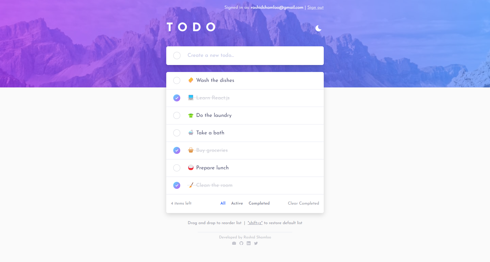
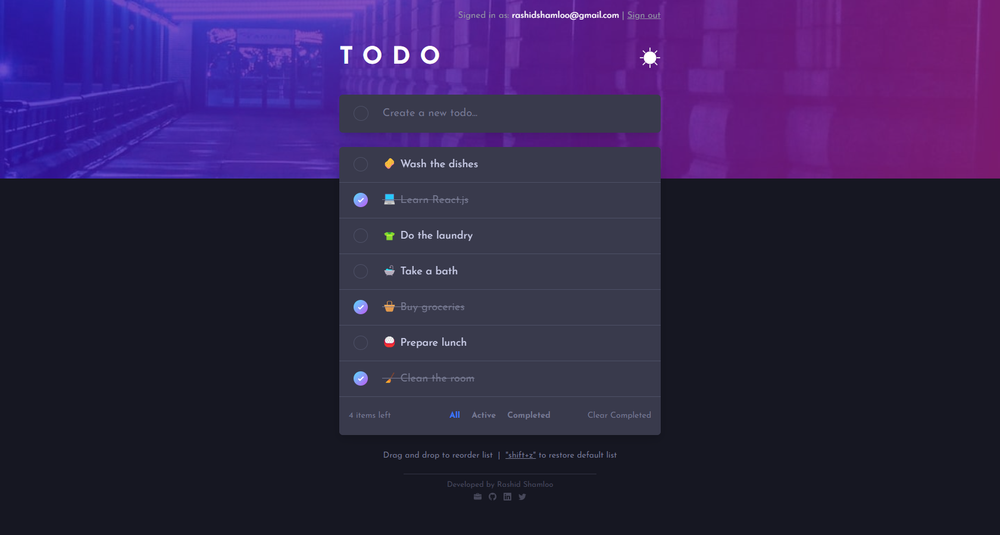
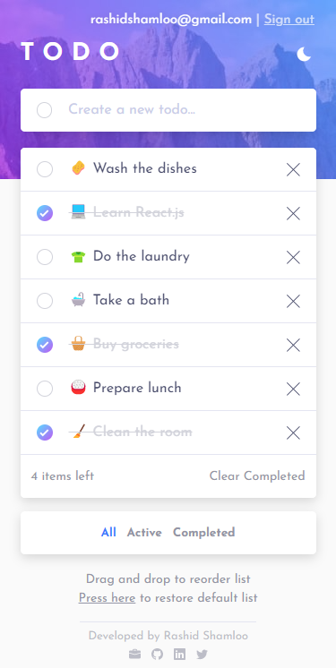
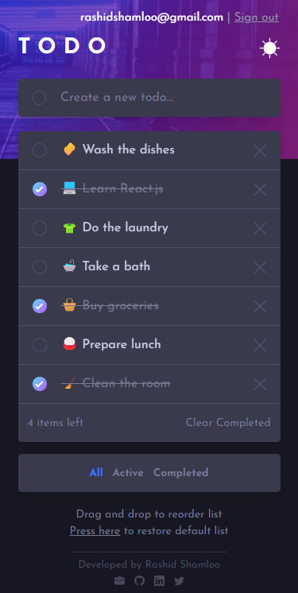

# Front End Mentor - Project 034 - Todo app - with Firebase Integration

This is a solution to the [Todo app challenge on Frontend Mentor](https://www.frontendmentor.io/challenges/todo-app-Su1_KokOW).

## Table of contents

- [Overview](#overview)
  - [Screenshot](#screenshot)
  - [Links](#links)
- [My process](#my-process)
  - [Features](#features)
  - [Built with](#built-with)
  - [What I learned](#what-i-learned)
  - [Useful resources](#useful-resources)
- [Author](#author)

## Overview

### Screenshot

- Desktop

- Mobile

### Links

- Solution URL: https://github.com/rashidshamloo/fem_034_todo-app_firebase/
- Live Site URL: https://rashidshamloo.github.io/fem_034_todo-app_firebase/

## My process

### Features

- User authentication using `Firebase Auth` (Email/Password and Google)
- `FirebaseUI` integration (and getting it to work with `Firebase v9` compatibility layer)
- Anonymouse user login and data storage
- Upgrading Anonymous user to signed-in user and preserving the todo list / user preferences
- Handling merge conflict when logging in to an existing account by deleting the anonymouse user's todo list / user preferences and the anonymous user itself to keep the database clean
- Saving user's light/dark theme choice in `Firestore` database and applying it on next visit.
- Todo list is stored in `Firestore` database and loaded on next visit.
- Minimum amount of db queries by utilizing `Firetore`'s `writeBatch()` function
- Real-time data (latency compensation) using `Firestore`'s `onSnapshot()` function
- `Firestore` database security rules to limit access to only the documents that contain the same user id (each user can only read/write his own items to the database)
- Animated light/dark theme switch implemented using Tailwind CSS's `dark:` class.
- Animated / Fade header background image change when changing light/dark theme mode. (implemented using two elements with transition that change opacity based on which mode is active)
- Gradient border for check boxes. (implemented using a background on the main element and a solid color on a child with absolute positioning and inset to make only the border line visible)
- Add/Plus button for Todo item that shows when the input field is filled and hides when it is empty. (form submit is also only enabled when the input field is filled)
- Animated remove/cross button for todo items that is hidden by default and only shows on hover on desktop but is always visible on touch devices.
- Ability to restore the default Todo list on desktop using `shift+z` / click and on mobile by pressing the link (and text hint changes based on which device is showing)
- Todo list with ability to add, remove, reorder, restore default, set as completed or not, and clear completed items
- Ability to filter list of items shown based on whether they're completed or not. (and different element position for filter select element in mobile vs desktop)
- Reorder of Todo items using framer motion's `Reorder` component with some improvements (fixed elements getting stuck if clicked while animating to place, added cursor grabbing icon when elements are clicked / held)
- Other minor details like:
  - The `reset todo list` text having a drop shadow when list is empty and it's placed on top of background image for better visibility.
  - `X items left` showing `item` instead of `items` when only 1 item is left.
  - Applying smooth animations/transitions to all elements when switching the theme between light and dark mode.
  - Disabling the transitions by default and enabling them only after page load to remove the white to black transition at start when the dark mode is used by default.
  - Enabling reordering only when all todo items are visible and disabling it in filtered views. (and changing the related text in wach case)
  - Smooth fade in / out and scale for Todo list when items are added / removed. (using `Framer Motion`'s `<AnimatePresence>` component)
  - Hiding todo list and filter sections when there are no items in the list and showing them after the first item is added.

### Built with

- Vite / React.js
- Tailwind CSS
- Framer Motion
- TypeScript
- Firebase Auth
- FirebaseUI
- Firestore

### What I learned

- Animating background image change
- Adding gradient border color to checkboxes
- Using `uuid` package to generate unique ids
- Using `Framer Motions`'s `Reorder` component to add drag/drop reordering to items
- Using `Framer Motions`'s `useMotionValue()` hook to read the current motion value and change styles based on it
- Using `!important` in Tailwind CSS
- Removing transitions at the start and enabling them on page load to prevent the unwanted transition effect when dark mode is default
- Using `hoverOnlyWhenSupported` setting in Tailwind to disable hover effects on touch devices
- Using `matchMedia()` to detect if a media query applies to the current document
- Implementing user authentication using Firebase
- Using FirebaseUI (and getting it to work with firebase v9 compatibility layer)
- Using NoSQL (collection/document) databases like Firestore
- Performing CRUD operations using Firestore in React
- Using `writeBatch()` in Firestore to perform multiple actions in one batch
- Learned about `latency compensation` and `optimistic rendering` in Firestore
- Using `onSnapshot()` to eliminate delays while updating the data in the database
- Firestore database security rules to limit read/writes
- Using `anonymous` user sign-in with Firebase
- Upgrading anonymous user on login while keeping the data and userId
- Handling merge conflict while upgrading anonymous user to an existing account
- Implementing `focus trapping` for the modal and related ARIA attributes
- FirebaseUI error handling (by returning a promise in `signInFailure` callback function)

### Useful resources

- [Firebase](https://firebase.google.com/) - Back-end services/platform offered by Google used in this challenge
- [Firestore](https://firebase.google.com/docs/firestore/) - Database used in this challenge
- [FirebaseUI](https://github.com/firebase/firebaseui-web) - Firebase UI library used in this challenge.
- [Framer Motion](https://www.framer.com/motion) - The animation library used in this challenge.
- [react-responsive](https://www.npmjs.com/package/react-responsive) - The package i used to test for different media queries and apply different logic for mobile/desktop

## Author

- Portfolio - [rashidshamloo.ir](https://www.rashidshamloo.ir)
- Linkedin - [rashid-shamloo](https://www.linkedin.com/in/rashid-shamloo/)
- Frontend Mentor - [@rashidshamloo](https://www.frontendmentor.io/profile/rashidshamloo)
- Twitter - [@rashidshamloo](https://www.twitter.com/rashidshamloo)
- Dev.to - [@rashidshamloo](https://dev.to/rashidshamloo)
